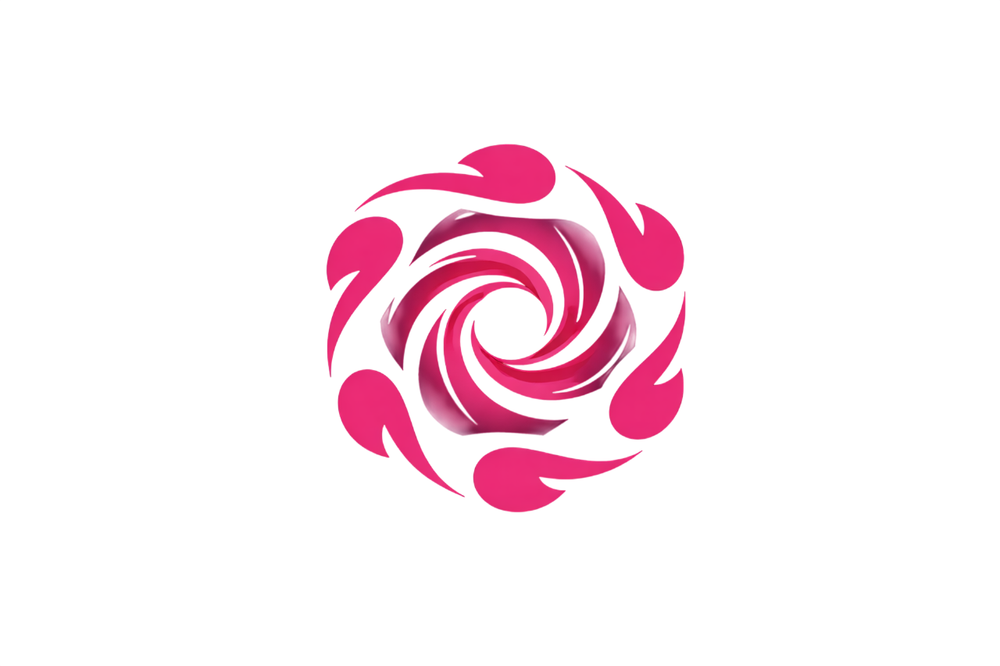

<p align="center">
  
</p>

<h1 align="center">obi-kit — AI Agent SDK</h1>

<p align="center">
  TypeScript monorepo — LangChain tools and SDK for building AI agents on top of the Obidot protocol.
</p>

---

## Packages

| Package                               | Description                                              | Version                                                                                                 |
| ------------------------------------- | -------------------------------------------------------- | ------------------------------------------------------------------------------------------------------- |
| [`@obidot-kit/core`](./packages/core) | ABIs, types, EVM context, WebSocket client               | [](https://www.npmjs.com/package/@obidot-kit/core) |
| [`@obidot-kit/llm`](./packages/llm)   | 19+ LangChain tools — vault, swap, intent, oracle, admin | [](https://www.npmjs.com/package/@obidot-kit/llm)   |
| [`@obidot-kit/sdk`](./packages/sdk)   | High-level SDK combining core + llm                      | [](https://www.npmjs.com/package/@obidot-kit/sdk)   |
| [`@obidot-kit/cli`](./packages/cli)   | CLI — `obi-kit init / run / info`                        | [](https://www.npmjs.com/package/@obidot-kit/cli)   |

```
cli → sdk → llm → core
```

## Quick Start

```sh
pnpm add @obidot-kit/sdk
```

```ts
import { ObiKit } from "@obidot-kit/sdk";
import { createEvmContext, OBIDOT_VAULT_ADDRESS } from "@obidot-kit/core";

const evmContext = createEvmContext({
  rpcUrl: "https://eth-rpc-testnet.polkadot.io/",
  privateKey: process.env.PRIVATE_KEY as `0x${string}`,
});

const kit = new ObiKit({ evmContext });

kit.registerVault({
  id: "obidot-paseo",
  address: OBIDOT_VAULT_ADDRESS,
  asset: "DOT",
  decimals: 10,
});

// Get LangChain-compatible tools
const tools = kit.getTools();
// VaultDepositTool, VaultWithdrawTool, SwapQuoteTool,
// ExecuteIntentTool, BifrostYieldTool, OracleUpdateTool, …
```

### With LangChain

```ts
import { ChatOpenAI } from "@langchain/openai";
import { createAgent } from "@obidot-kit/llm";

const agent = createAgent({
  model: new ChatOpenAI({ model: "gpt-4" }),
  additionalTools: kit.getTools(),
});

// "Deposit 50 DOT into the vault"
// "Get a swap quote for 10 DOT → USDC"
// "Execute a cross-chain intent to Hydration"
```

## Development

```sh
git clone https://github.com/obidot/obi-kit.git
cd obi-kit
pnpm install
pnpm build
```

| Command          | Description                  |
| ---------------- | ---------------------------- |
| `pnpm build`     | Build all packages           |
| `pnpm test`      | Run all tests (Vitest)       |
| `pnpm lint`      | Lint (Biome)                 |
| `pnpm typecheck` | Type-check all packages      |
| `pnpm changeset` | Create a changeset           |
| `pnpm release`   | Publish all changed packages |

## Writing a Custom Tool

```ts
import { ObiBaseTool } from "@obidot-kit/llm";
import { z } from "zod";

const schema = z.object({
  amount: z.string().describe("Amount to stake"),
});

export class MyStakeTool extends ObiBaseTool<typeof schema> {
  name = "my_stake";
  description = "Stake tokens in my protocol.";
  schema = schema;

  protected async execute(input: z.infer<typeof schema>) {
    // on-chain logic
    return { success: true, message: `Staked ${input.amount}` };
  }
}
```

## License

[MIT](LICENSE)
